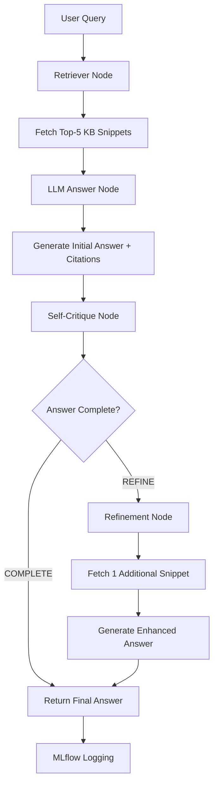

# 🤖 Agentic RAG System with Azure OpenAI & LangGraph

A comprehensive Retrieval-Augmented Generation (RAG) system that combines Azure OpenAI, Pinecone vector database, and MLflow observability to provide intelligent question-answering with self-critique and refinement capabilities.

## 📋 Overview

This system implements a 4-node LangGraph workflow:
1. **Retriever Node**: Fetches top-5 KB snippets from Pinecone
2. **LLM Answer Node**: Generates initial answer with Azure GPT-4 mini + citations
3. **Self-Critique Node**: Uses Azure GPT-4 mini to evaluate answer completeness
4. **Refinement Node**: Retrieves additional snippets and regenerates answer if needed

## 🎯 Features

- ✅ **Azure OpenAI Integration**: Uses GPT-4 mini for both answer generation and self-critique
- ✅ **Vector Search**: Pinecone for semantic similarity search
- ✅ **Self-Critique Loop**: Automatic answer quality assessment
- ✅ **Refinement Process**: Enhanced answers when initial response is incomplete
- ✅ **Citation Support**: [KBxxx] format citations for all sources
- ✅ **MLflow Logging**: Comprehensive observability and tracking
- ✅ **30 Knowledge Base Entries**: Pre-loaded technical documentation

## 📁 Project Structure

```
/Users/ravis/Assignment/
├── README.md                           # This file
├── config.py                          # Configuration settings
├── data_loader.py                     # Knowledge base loading
├── clients.py                         # Service client management
├── rag_nodes.py                       # LangGraph workflow nodes
├── mlflow_logger.py                   # MLflow logging utilities
├── main.py                           # Main execution script
├── requirements.txt                   # Python dependencies
├── self_critique_loop_dataset.json    # Knowledge base data (30 entries)
├── Assignment3.pdf                    # Original assignment instructions
└── Assignment3_pinecone_quickstart_guide.ipynb  # Starter notebook
```

## 🚀 Quick Start

### Prerequisites

- Python 3.10 or higher
- Azure OpenAI API access
- Pinecone account (trial is sufficient)
- MLflow (optional, for logging)

### Step 1: Install Dependencies

```bash
# Install all required packages
pip3 install langgraph azure-ai-inference pinecone mlflow langchain langchain-openai pydantic python-dotenv
```

### Step 2: Configure API Keys

Edit `config.py` and replace the placeholder values with your actual API keys:

```python
# Azure OpenAI Configuration
AZURE_OPENAI_API_KEY = "your_actual_azure_openai_api_key"
AZURE_OPENAI_ENDPOINT = "https://your-actual-resource.openai.azure.com/"
AZURE_OPENAI_API_VERSION = "2024-02-15-preview"

# Model deployments (update these with your deployment names)
GPT4_MINI_MODEL_NAME = "gpt-4-mini"
EMBEDDING_MODEL_NAME = "text-embedding-3-small"

# Pinecone Configuration
PINECONE_API_KEY = "your_actual_pinecone_api_key"
PINECONE_INDEX_NAME = "agentic-rag-kb"

# MLflow Configuration
MLFLOW_TRACKING_URI = "http://localhost:5000"
```

### Step 3: Run the System

```bash
python3 main.py
```

## 🔧 Configuration Details

### Azure OpenAI Setup

1. **Create Azure OpenAI Resource**: Set up an Azure OpenAI resource in Azure Portal
2. **Deploy Models**: Deploy `gpt-4-mini` and `text-embedding-3-small` models
3. **Get API Key**: Copy the API key from Azure Portal
4. **Update Endpoint**: Use your resource endpoint URL

### Pinecone Setup

1. **Create Account**: Sign up for Pinecone (free tier available)
2. **Create Index**: Create an index named `agentic-rag-kb`
3. **Get API Key**: Copy your API key from Pinecone console
4. **Configure Dimensions**: Use 1536 dimensions for `text-embedding-3-small`

### MLflow Setup (Optional)

1. **Start MLflow Server**: `mlflow ui --host 0.0.0.0 --port 5000`
2. **Access UI**: Open http://localhost:5000 in your browser
3. **View Logs**: Monitor runs, metrics, and artifacts

## 📊 System Workflow

### 1. Data Loading
- Loads 30 knowledge base entries from `self_critique_loop_dataset.json`
- Each entry contains: `doc_id`, `question`, `answer_snippet`, `source`, `confidence_indicator`, `last_updated`

### 2. RAG Pipeline Execution



### 3. Sample Queries

The system processes these predefined queries:
- "What are best practices for caching?"
- "How should I set up CI/CD pipelines?"
- "What are performance tuning tips?"
- "How do I version my APIs?"
- "What should I consider for error handling?"

## 🔍 Key Components

### Configuration (`config.py`)
- Centralized API keys and settings
- Model deployment configurations
- Debug and logging options
- Configuration validation

### Data Loader (`data_loader.py`)
- JSON knowledge base loading
- Entry formatting for embedding
- Data validation and error handling

### Client Manager (`clients.py`)
- Azure OpenAI client initialization
- Pinecone client setup
- MLflow configuration
- Error handling and fallbacks

### RAG Nodes (`rag_nodes.py`)
- **Retriever Node**: Semantic search with Pinecone
- **LLM Answer Node**: Answer generation with citations
- **Self-Critique Node**: Answer quality assessment
- **Refinement Node**: Enhanced answer generation

### MLflow Logger (`mlflow_logger.py`)
- Run tracking and parameter logging
- Metrics and artifact storage
- Experiment summary generation
- Recent runs listing

### Main Integration (`main.py`)
- System initialization
- Sample query execution
- Result analysis and reporting
- Comprehensive testing framework

## 📈 Expected Output

When running successfully, you'll see:

```
🚀 Agentic RAG System - Comprehensive Test
============================================================

1️⃣ Validating Configuration...
✅ All configurations are set!

2️⃣ Loading Knowledge Base...
✅ Loaded 30 KB entries from self_critique_loop_dataset.json

3️⃣ Initializing Service Clients...
✅ Azure OpenAI clients initialized
✅ Pinecone client initialized
✅ MLflow initialized

4️⃣ Running Sample Queries...
🧪 Testing Agentic RAG System with Sample Queries...
============================================================

Query 1: What are best practices for caching?
🔍 RETRIEVER: Searching for 'What are best practices for caching?...'
✅ Retrieved 5 documents
📝 Generated answer (450 chars)
🔍 SELF-CRITIQUE: Analyzing answer completeness
✅ Critique (Azure): COMPLETE
📊 Final Answer: [Comprehensive answer with citations]

Query 2: How should I set up CI/CD pipelines?
...
```

## 🛠️ Troubleshooting

### Common Issues

1. **Import Errors**: Ensure all dependencies are installed correctly
2. **API Key Errors**: Verify API keys are correctly set in `config.py`
3. **Pinecone Errors**: Check index name and API key
4. **Azure OpenAI Errors**: Verify endpoint URL and model deployment names

### Debug Mode

Enable debug mode in `config.py`:
```python
DEBUG_MODE = True
```

This will show detailed logging for each step of the RAG pipeline.

### Validation

Run configuration validation:
```python
from config import validate_config
validate_config()
```

## 📚 Dependencies

- **langgraph**: LangGraph workflow framework
- **azure-ai-inference**: Azure OpenAI client library
- **pinecone**: Pinecone vector database client
- **mlflow**: MLflow tracking and logging
- **langchain**: LangChain framework
- **langchain-openai**: OpenAI integration for LangChain
- **pydantic**: Data validation
- **python-dotenv**: Environment variable management

## 🎯 Assignment Requirements Met

✅ **Retrieves up to 5 KB snippets** from Pinecone  
✅ **Generates answers with Azure GPT-4 mini** (temperature=0)  
✅ **Includes [KBxxx] citations** in all responses  
✅ **Self-critique loop** with COMPLETE vs REFINE decision  
✅ **Refinement step** for incomplete answers  
✅ **MLflow integration** for observability  
✅ **Comprehensive testing framework** with sample queries  

## 📞 Support

For issues or questions:
1. Check the troubleshooting section above
2. Verify all API keys are correctly configured
3. Ensure all dependencies are installed
4. Check the debug logs for detailed error information

## 🚀 Ready to Run!

Once you've configured your API keys, simply run:

```bash
python3 main.py
```

The Agentic RAG System will automatically:
- Load the knowledge base
- Initialize all service clients
- Process sample queries
- Log everything to MLflow
- Provide comprehensive results

**Happy querying!** 🎉
